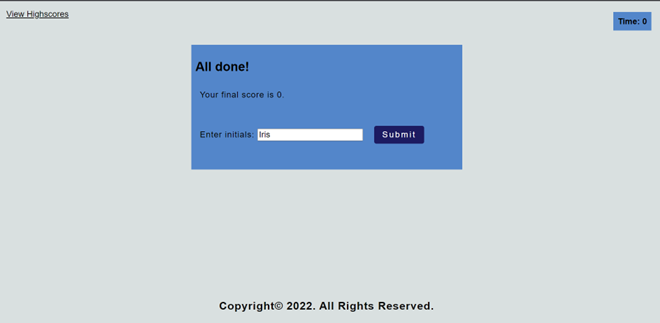

## My portfolio ##

Table of content:

1. About the proyect
2. Installation
3. Usage
4. Credits
5. License

# About the project #

The main purpose of this project is to measure some knowledge from JavaScript topic and be able to see improvement with the highscore to keep track of it,
it is an interactive multiple choice quiz with four different options (A, B, C, and D) in each question/statement and have a time limit affecting it also if the question choice selected is incorret. The user can interact with the questions since if the user selects a correct answer it will have a sound of correct option and also it will prompt a message: "Correct! Congrats" or if the user interact with the questions and clicks on an incorrect option, there will be a sound for incorect answers and it will prompt a message: "Wrong!, keep trying".  The user can name his/her scores and keep track of the progress made with the highscores list.

# Installation #
N/A

# Usage #

This multiple question quiz helps the user to interaqct and keep track of the progress he/she makes every time the user does it and keep the order of the progress from higher to lower. 
It is composed of a timer, a section of highscores linked to the main quiz once the user clicks on it.
The quiz is composed of five  questions with 4 different multiple choice buttons. it also includes 2 sounds: one for the correct answers and one for the incorrect answers. and prompts a message if the answer is correct/ wrong. Once the user gets the results, he/she can write a name to see in a list the scores made and keep track of the progress made or another option is clear the scores and start new ones.

Evidence of my portfolio with images:

- Linked of deployed application:

# Credits #

N/A

# License #

N/A